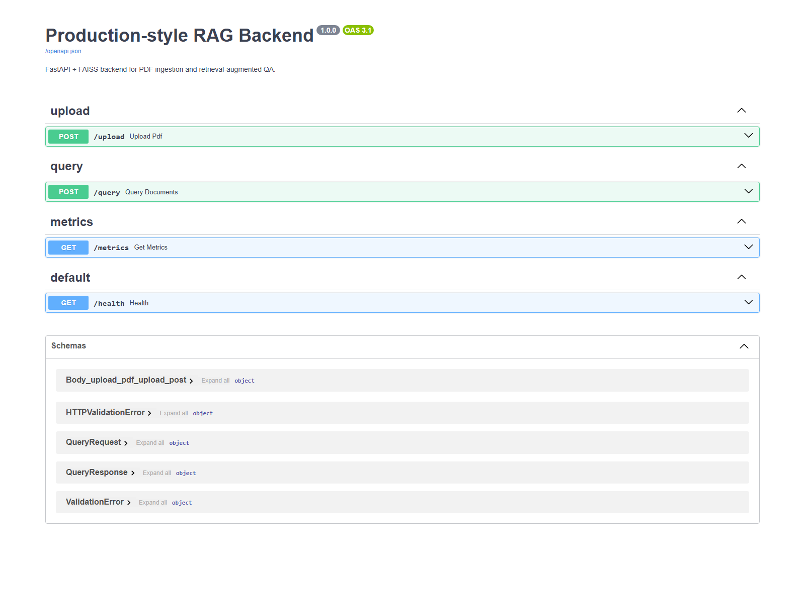
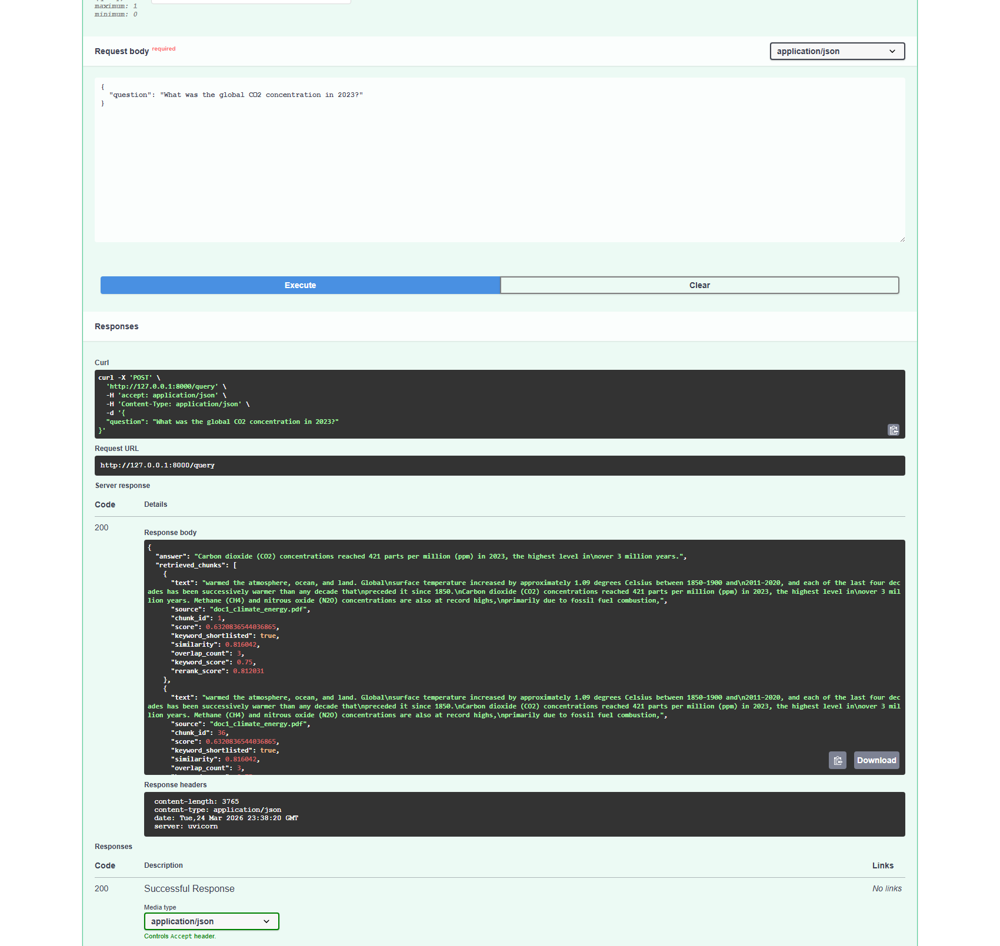
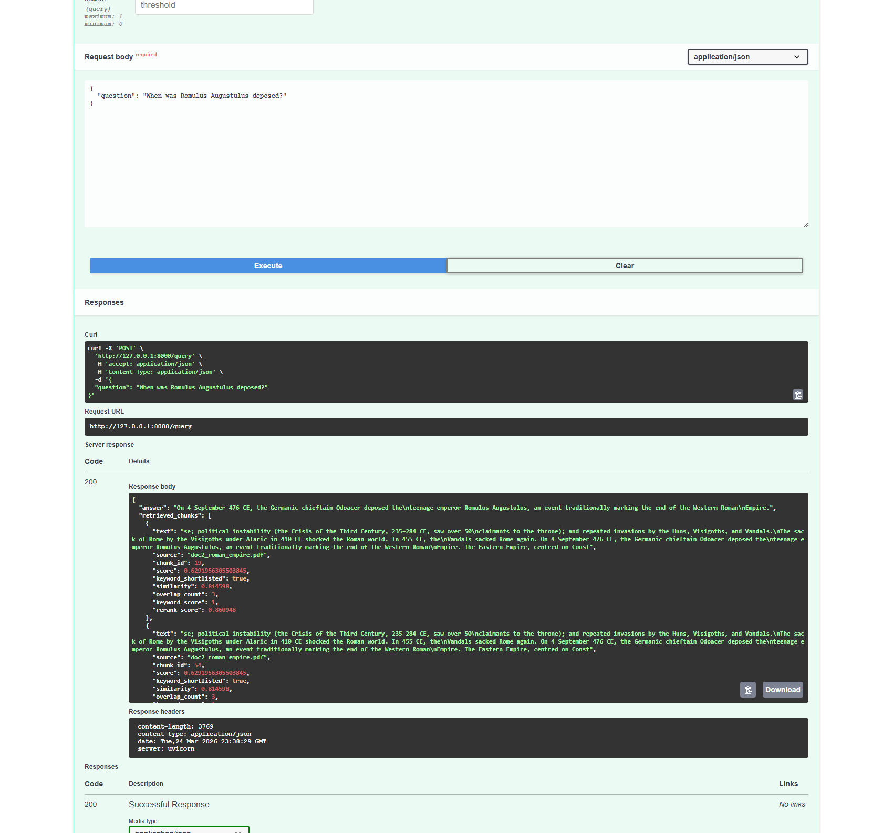

# RAG Document QA System (FastAPI + FAISS)

A production-style backend system for document understanding using Retrieval-Augmented Generation (RAG), designed with hybrid retrieval, configurable precision-recall tuning, and observability.

Upload PDFs, ask questions, get answers grounded strictly in your documents.

---

## Features

| Capability | Detail |
|---|---|
| **Ingestion** | PDF upload → text extraction → chunking (`size=500`, `overlap=100`) |
| **Embeddings** | SentenceTransformers (`all-MiniLM-L6-v2` by default) |
| **Retrieval** | Hybrid: keyword pre-filter → FAISS vector search → re-ranking |
| **Generation** | OpenAI (configurable model) with strict context-only prompting; extractive fallback if no API key |
| **Caching** | In-memory query cache with configurable TTL |
| **Observability** | Structured logs per query + `/metrics` endpoint |

---

## Project Structure

```
app/
├── main.py
├── api/
│   ├── upload.py
│   ├── query.py
│   └── metrics.py
├── core/
│   └── config.py
├── services/
│   ├── embedding.py
│   ├── ingestion.py
│   ├── retriever.py
│   ├── generator.py
│   ├── cache.py
│   └── metrics.py
├── db/
│   └── vector_store.py
└── utils/
    └── pdf_loader.py
requirements.txt
README.md
```

---

## Quickstart

### 1. Install

```bash
python -m venv .venv
.venv\Scripts\activate       # Windows
# source .venv/bin/activate  # macOS / Linux

pip install -r requirements.txt
```

### 2. Configure (optional)

All settings have defaults and can be overridden via environment variables:

```bash
set OPENAI_API_KEY=your_openai_api_key   # omit to use extractive fallback
set OPENAI_MODEL=gpt-4o-mini
set EMBEDDING_MODEL=all-MiniLM-L6-v2
set DATA_DIR=data
set TOP_K=5
set SIMILARITY_THRESHOLD=0.7
set QUERY_CACHE_TTL_SECONDS=300
```

> Defaults are defined in `app/core/config.py`. `TOP_K` and `SIMILARITY_THRESHOLD` can also be overridden per request at query time.

### 3. Run

```bash
uvicorn app.main:app --reload
```

- API: `http://127.0.0.1:8000`  
- Interactive docs: `http://127.0.0.1:8000/docs`

---

## API Reference

### `POST /upload` — Ingest a PDF

Upload a PDF file for chunking and indexing.

**Form field:** `file` (multipart/form-data)

```bash
curl -X POST "http://127.0.0.1:8000/upload" \
  -H "Content-Type: multipart/form-data" \
  -F "file=@sample.pdf;type=application/pdf"
```

**Response**

```json
{
  "status": "success",
  "filename": "sample.pdf",
  "chunks_created": 18,
  "characters_processed": 8432
}
```

---

### `POST /query` — Ask a Question

Query across all ingested documents.

**Query params (optional)**

| Param | Type | Description |
|---|---|---|
| `top_k` | int | Number of chunks to retrieve (overrides default) |
| `threshold` | float 0–1 | Minimum similarity score to include a chunk |

**Request body**

```json
{
  "question": "What is the refund policy?"
}
```

```bash
# Basic query
curl -X POST "http://127.0.0.1:8000/query" \
  -H "Content-Type: application/json" \
  -d '{"question": "What is the refund policy?"}'

# With retrieval overrides
curl -X POST "http://127.0.0.1:8000/query?top_k=3&threshold=0.6" \
  -H "Content-Type: application/json" \
  -d '{"question": "What is the refund policy?"}'
```

**Response — answer found**

```json
{
  "answer": "Refunds are allowed within 30 days of purchase.",
  "retrieved_chunks": [
    {
      "text": "...",
      "source": "sample.pdf",
      "chunk_id": 7,
      "score": 0.8123,
      "rerank_score": 0.8342
    }
  ],
  "response_time_ms": 184.72
}
```

**Response — no relevant context found**

```json
{
  "answer": "Not found",
  "retrieved_chunks": [],
  "response_time_ms": 12.34
}
```

---

### `GET /metrics` — Runtime Stats

```json
{
  "total_queries": 12,
  "avg_response_time": 27.41,
  "cache_hits": 5,
  "cache_misses": 7
}
```

---

## How It Works

```
PDF Upload
  └─► Text extraction
        └─► Chunking (500 chars, 100 overlap)
              └─► Embedding (SentenceTransformers)
                    └─► FAISS index (persisted to DATA_DIR)

Query
  └─► Cache check (hit → return immediately)
        └─► Keyword pre-filter
              └─► FAISS vector search (top_k)
                    └─► Re-ranking
                          └─► Threshold filter
                                └─► LLM generation (or extractive fallback)
                                      └─► Cache store + return
```

**Prompt contract** — the generator always uses this system instruction:

> *Answer ONLY using the provided context. If the answer is not in the context, say "Not found".*

---

## Observability

Every query logs:

- Query text
- Response time (ms)
- Chunk count retrieved
- Cache status (`hit` / `miss`)
- Active `top_k` and `threshold` values
- Top chunk previews with scores and source filenames

---

## Production Notes

- **Persistence** — FAISS index and chunk metadata are written to `DATA_DIR` (`data/` by default) on each upload and reloaded on startup.
- **Caching** — In-memory, keyed by normalised query string, evicted after `QUERY_CACHE_TTL_SECONDS`.
- **Retrieval tuning** — Hybrid retrieval (keyword → vector → rerank) balances precision and recall. Raise `threshold` to tighten answers; lower `top_k` to reduce latency.
- **Scaling** — For high-throughput ingestion, consider an async task queue (Celery, ARQ). Add authentication and rate limiting before exposing the API publicly.
- **No API key** — The extractive fallback selects the highest-scoring retrieved chunk as the answer, so the system remains functional without OpenAI access.

---

## UI Screenshots

Swagger overview:



`POST /query` execution with question:
`What was the global CO2 concentration in 2023?`



`POST /query` execution with question:
`When was Romulus Augustulus deposed?`


